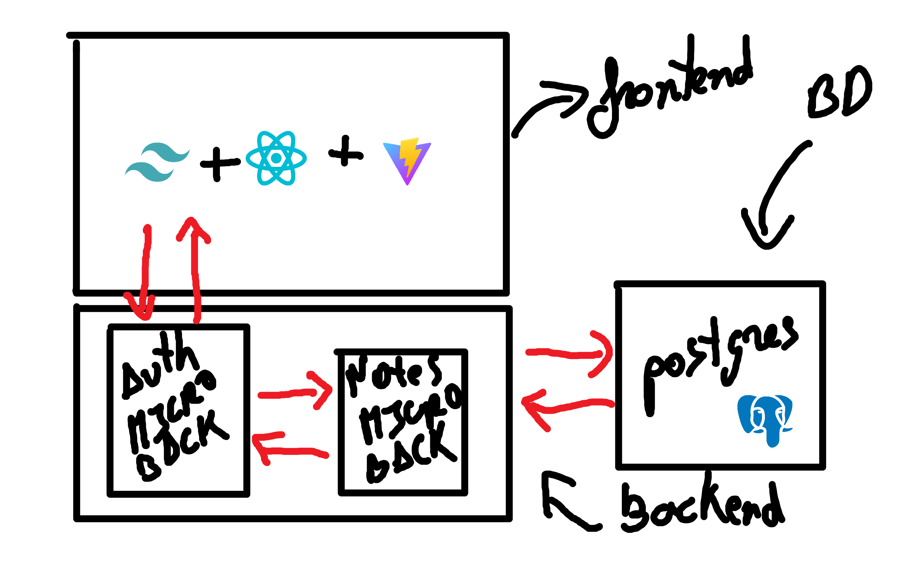

# **Arquitectura y Tecnologías del Proyecto Zetter**

## 1. **📜Introducción**

Este documento describe cómo he estructurado **Zetter**: una aplicación open-source diseñada para aquellos que buscan organizar y conectar sus ideas de manera eficiente utilizando el método Zettelkasten. El objetivo es ofrecer una herramienta flexible que permita a los usuarios gestionar y explorar sus notas, conceptos y conexiones de manera fluida, optimizando el proceso de aprendizaje, investigación y creatividad. El **MVP** está compuesto por un backend modular usando **Django** y un frontend desarrollado con **React** + **Vite** + **Tailwind**. La arquitectura busca ofrecer una experiencia intuitiva y escalable a medida que el proyecto evoluciona y crece.

---

## 2. **🔧Estructura del Backend**

### 🐍Tecnologías Utilizadas

### **Django**
[Django](https://www.djangoproject.com/) es un framework de alto nivel para el desarrollo de aplicaciones web con Python. Proporciona una estructura sólida y escalable que simplifica tareas comunes como la gestión de bases de datos, autenticación de usuarios, generación de documentos y creación de APIs RESTful. Su enfoque en la reutilización de código y la rapidez en el desarrollo permite construir aplicaciones robustas de manera eficiente.

### **Django Rest Framework (DRF)**
[Django Rest Framework](https://www.django-rest-framework.org/) (DRF) es una biblioteca versátil y robusta que facilita la creación de APIs RESTful en Django. Con DRF, se puede desarrollar de forma rápida y sencilla la capa de comunicación entre el frontend y los microservicios, asegurando una integración eficiente y escalable en sistemas distribuidos.

### **JWT (JSON Web Tokens)**
La autenticación de usuarios se gestiona mediante **JWT (JSON Web Tokens)**. Este estándar proporciona un método seguro para transmitir información de autenticación entre el frontend y los microservicios, asegurando que solo los usuarios autorizados puedan acceder a los recursos del sistema. JWT permite una autenticación sin estado, lo que lo hace ideal para aplicaciones distribuidas y servicios en la nube.

### **Bases de Datos: PostgreSQL**
Para la gestión de bases de datos, utilizo **PostgreSQL** por su robustez, escalabilidad y soporte para características avanzadas como transacciones ACID, almacenamiento de datos complejos y consultas de alto rendimiento. Estas bases de datos gestionan información crítica como notas privadas de los usuarios.

El directorio del backend tiene la siguiente estructura:

```bash
backend/
├── auth_service/
│   ├── __pycache__/
│   ├── migrations/
│   ├── admin.py
│   ├── apps.py
│   ├── models.py
│   ├── serializers.py
│   ├── urls.py
│   ├── views.py
├── backend/
│   ├── __pycache__/
│   ├── settings.py
│   ├── urls.py
│   ├── wsgi.py
├── notes_service/
│   ├── __pycache__/
│   ├── migrations/
│   ├── admin.py
│   ├── apps.py
│   ├── models.py
│   ├── serializers.py
│   ├── urls.py
│   ├── views.py
```

### Descripción de los Directorios y Archivos

#### **auth_service/**: Microbackend encargado de la autenticación y gestión de usuarios.

- **admin.py**: Configuración del panel de administración de Django para gestionar modelos relacionados con la autenticación y usuarios.
- **apps.py**: Configuración de la aplicación Django, incluyendo la inicialización y la definición de la aplicación.
- **models.py**: Definición de los modelos de datos relacionados con la autenticación y los usuarios (como el usuario, grupos, permisos, etc.).
- **serializers.py**: Serializadores que convierten instancias de modelos a JSON y viceversa, facilitando la comunicación entre el backend y el frontend.
- **urls.py**: Definición de las rutas específicas de la aplicación para manejar las solicitudes HTTP relacionadas con la autenticación y la gestión de usuarios.
- **views.py**: Vistas que gestionan las solicitudes HTTP, procesan la lógica de autenticación y devuelven las respuestas correspondientes.

#### **backend/**: Configuración principal del proyecto Django.

- **settings.py**: Archivo de configuración global que gestiona las configuraciones del proyecto, como bases de datos, middleware, aplicaciones instaladas y configuraciones de seguridad.
- **urls.py**: Rutas principales del proyecto, donde se configuran las URLs globales y se incluyen las rutas de las aplicaciones (como `auth_service` y `notes_service`).
- **wsgi.py**: Configuración para el servidor WSGI, utilizado para servir la aplicación Django en producción.

#### **notes_service/**: Microbackend encargado de la gestión de notas.

- **admin.py**: Configuración del panel de administración de Django para gestionar los modelos de notas.
- **apps.py**: Configuración de la aplicación Django, que define la inicialización y configuración de `notes_service`.
- **models.py**: Definición de los modelos de datos relacionados con las notas (por ejemplo, notas, categorías, etiquetas).
- **serializers.py**: Serializadores que convierten las instancias de modelos de notas a JSON y viceversa, permitiendo la interacción con la API.
- **urls.py**: Definición de las rutas específicas de la aplicación para manejar solicitudes HTTP relacionadas con las notas.
- **views.py**: Vistas que manejan las solicitudes HTTP para crear, actualizar, leer y eliminar notas, devolviendo respuestas apropiadas a las solicitudes.

### Conclusión

La arquitectura del backend de **Zetter** está diseñada con un enfoque modular y escalable, utilizando microservicios en Django para gestionar diferentes funcionalidades de manera independiente. Este diseño facilita el mantenimiento, la evolución y la integración de nuevas características a medida que el proyecto crece.


## 3. **🖥️Estructura del Frontend**

### Tecnologías Utilizadas

### **React**
React es una biblioteca de JavaScript para construir interfaces de usuario. Permite crear componentes reutilizables y gestionar el estado de la aplicación de manera eficiente.

### **TypeScript**
TypeScript es un superconjunto de JavaScript que añade tipado estático. Ayuda a detectar errores en tiempo de desarrollo y mejora la mantenibilidad del código.

### **Vite**
Vite es un entorno de desarrollo rápido para proyectos de frontend. Proporciona una configuración mínima y una experiencia de desarrollo rápida y eficiente.

### **React Router**
React Router es una biblioteca para gestionar las rutas en aplicaciones React. Permite definir rutas y navegar entre diferentes vistas de la aplicación.

### **CSS Modules**
CSS Modules es una técnica para escribir CSS que es local por defecto. Permite evitar conflictos de nombres y mantener los estilos encapsulados en los componentes.

El directorio del frontend tiene la siguiente estructura:   

```bash
frontend/
├── .env
├── public/
│   └── vite.svg
├── src/
│   ├── App.css
│   ├── App.tsx
│   ├── index.css
│   ├── main.tsx
│   ├── router.tsx
│   ├── types.ts
│   ├── vite-env.d.ts
│   ├── assets/
│   │   ├── avatar.png
│   │   ├── connect.svg
│   │   ├── female1.svg
│   │   ├── female2.svg
│   │   ├── flexible.svg
│   │   ├── growth.svg
│   │   ├── icon.ico
│   │   ├── icon.png
│   │   ├── knowledge.svg
│   │   ├── male1.svg
│   │   ├── male2.svg
│   │   ├── pilot.svg
│   │   └── react.svg
│   ├── components/
│   │   ├── About.tsx
│   │   ├── FAQ.tsx
│   │   ├── Features.tsx
│   │   ├── Footer.tsx
│   │   ├── Hero.tsx
│   │   ├── HeroCards.tsx
│   │   ├── HowItWorks.tsx
│   │   ├── Icons.tsx
│   │   ├── mode-toggle.tsx
│   │   ├── Navbar.tsx
│   │   ├── Newsletter.tsx
│   │   ├── NoteEditor.tsx
│   │   └── ...
│   ├── lib/
│   │   └── utils.ts
│   ├── pages/
│   │   ├── HomePage.tsx
│   │   ├── NotesPage.tsx
│   │   ├── ProfilePage.tsx
│   │   └── ZetterGraph.tsx
```

### Descripción de los Directorios y Archivos

- **.env**: Archivo de configuración que define las variables de entorno utilizadas en la aplicación.
  
- **public/**: Directorio que contiene archivos estáticos accesibles directamente desde el navegador.
  - **vite.svg**: Logo de Vite utilizado en la interfaz de la aplicación.

- **src/**: Directorio principal que contiene el código fuente de la aplicación.
  - **App.css**: Estilos globales aplicados a la aplicación.
  - **App.tsx**: Componente principal que renderiza la estructura básica de la aplicación.
  - **index.css**: Estilos globales adicionales para la personalización del diseño.
  - **main.tsx**: Punto de entrada principal de la aplicación, donde se inicializa React.
  - **router.tsx**: Configuración de las rutas de navegación en la aplicación.
  - **types.ts**: Definiciones de tipos TypeScript utilizadas en la aplicación.
  - **vite-env.d.ts**: Declaraciones de tipos necesarias para la integración con Vite.

- **assets/**: Directorio que contiene recursos estáticos como imágenes e íconos.
  
- **components/**: Directorio que contiene componentes reutilizables a través de la aplicación.
  - **About.tsx**: Componente que representa la sección "Acerca de".
  - **FAQ.tsx**: Componente para la sección de preguntas frecuentes.
  - **Features.tsx**: Componente para la sección de características de la aplicación.
  - **Footer.tsx**: Componente que define el pie de página de la aplicación.
  - **Hero.tsx**: Componente que muestra la sección principal (Hero) en la interfaz.
  - **HeroCards.tsx**: Componente que muestra las tarjetas informativas en la sección principal.
  - **HowItWorks.tsx**: Componente para la sección "Cómo funciona".
  - **Icons.tsx**: Componente para manejar los íconos utilizados en la interfaz.
  - **mode-toggle.tsx**: Componente que permite cambiar entre el modo oscuro y claro de la aplicación.
  - **Navbar.tsx**: Componente de la barra de navegación.
  - **Newsletter.tsx**: Componente para la sección de suscripción al boletín informativo.
  - **NoteEditor.tsx**: Componente para el editor de notas en la aplicación.

- **lib/**: Directorio que contiene funciones y utilidades auxiliares.
  - **utils.ts**: Archivo que incluye funciones utilitarias comunes utilizadas a lo largo del proyecto.

- **pages/**: Directorio que contiene las páginas principales de la aplicación.
  - **HomePage.tsx**: Página principal de la aplicación.
  - **NotesPage.tsx**: Página dedicada a la gestión y visualización de notas.
  - **ProfilePage.tsx**: Página de perfil del usuario.
  - **ZetterGraph.tsx**: Página que muestra el gráfico de Zetter.

### Conclusión
La arquitectura del frontend de Zetter está diseñada para ser modular y escalable, utilizando React y TypeScript para gestionar componentes y estados de manera eficiente. Esto facilita el mantenimiento y la evolución del proyecto a medida que crece y se añaden nuevas características.

--- 

## 4. **⚒️Flujo de Funcionamiento del Proyecto Zetter**

## 🔧Flujo de Funcionamiento del Backend

### Autenticación y Autorización

1. **Registro de Usuario**:
   - El usuario envía una solicitud de registro al endpoint `/auth/create/` del `auth_service`.
   - El `auth_service` valida los datos, crea un nuevo usuario en la base de datos y devuelve un par de tokens JWT.

2. **Inicio de Sesión**:
   - El usuario envía una solicitud de "inicio de sesión" al endpoint `/auth/token/` del `auth_service`.
   - El `auth_service` valida las credenciales, devuelve al usuario su par de tokens.

3. **Autorización**:
   - Para acceder a recursos protegidos, el usuario debe incluir el token JWT en el encabezado de la solicitud y acceder a través del endpoint `/auth/an/{subpath}`, ya que solo se cuenta con un microbackend además del `auth_service` se accede a través de `an` abreviatura de "auth notes".
   - El backend valida el token JWT y permite el acceso a los recursos si el token es válido.

### Gestión de Notas

1. **Creación de Notas**:
   - El usuario envía una solicitud de creación de nota al endpoint `/notes/` del `notes_service`.
   - El `notes_service` valida los datos, crea una nueva nota en la base de datos y devuelve la nota creada.

2. **Lectura de Notas**:
   - El usuario envía una solicitud de lectura de notas al endpoint `/notes/` del `notes_service`.
   - El `notes_service` recupera las notas del usuario desde la base de datos y las devuelve.

3. **Actualización de Notas**:
   - El usuario envía una solicitud de actualización de nota al endpoint `/notes/<id>` del `notes_service`.
   - El `notes_service` valida los datos, actualiza la nota en la base de datos y devuelve la nota actualizada.

4. **Eliminación de Notas**:
   - El usuario envía una solicitud de eliminación de nota al endpoint `/notes/<id>` del `notes_service`.
   - El `notes_service` elimina la nota de la base de datos y confirma la eliminación.

## 🖥️Flujo de Funcionamiento del Frontend

### Interacción del Usuario

1. **Inicio de Sesión y Registro**:
   - El usuario accede al componente de inicio de sesión o registro a través del componente `Navbar.tsx`.
   - El frontend envía las credenciales al backend y recibe un par de tokens JWT en respuesta.
   - El token refresh JWT se almacena en el almacenamiento local del navegador para futuras solicitudes.

2. **Navegación**:
   - El usuario navega entre diferentes páginas utilizando la barra de navegación.
   - React Router gestiona las rutas y carga los componentes correspondientes para cada página y para cada tipo de usuario (registrado o invitado).

3. **Gestión de Notas**:
   - El usuario puede crear, leer, actualizar y eliminar notas desde la interfaz de usuario.
   - El frontend envía solicitudes al backend utilizando el token JWT para autenticar las solicitudes.
   - Las respuestas del backend se utilizan para actualizar el estado de la aplicación y mostrar los datos correspondientes.

### Componentes Principales

- **Navbar**: Barra de navegación que permite al usuario moverse entre diferentes secciones de la aplicación.
- **HomePage**: Página principal que muestra una visión general de la aplicación.
- **NotesPage**: Página donde el usuario puede gestionar sus notas.
- **ProfilePage**: Página donde el usuario puede ver y editar su perfil.
- **NoteEditor**: Componente que permite al usuario crear y editar notas.
- **Footer**: Componente que permite al usuario visualizar datos menos revelantes del proyecto.

## 📞Comunicación entre Frontend y Backend

1. **Solicitudes HTTP**:
   - El frontend utiliza `fetch` o bibliotecas como `axios` para enviar solicitudes HTTP al backend.
   - Las solicitudes incluyen el token JWT en el encabezado para autenticar al usuario.

2. **Manejo de Respuestas**:
   - El frontend maneja las respuestas del backend y actualiza el estado de la aplicación en consecuencia.
   - En caso de errores, el frontend muestra mensajes de error apropiados al usuario.

Un esquema que refleja toda la arquitectura y funcionamiento diseñados para el proyecto es la siguiente imagen.



Finalmente, es importante destacar que el uso de tokens proporciona una capa adicional de seguridad en la autenticación. En el backend, se generan dos tipos de tokens:  

- **Access Token**: Es un token de corta duración que se utiliza para autenticar y autorizar solicitudes a la API. Su tiempo de vida predeterminado en Django REST Framework Simple JWT es de **5 minutos** (`ACCESS_TOKEN_LIFETIME = timedelta(minutes=5)`). Su expiración rápida reduce el riesgo en caso de que sea comprometido.  
- **Refresh Token**: Es un token de mayor duración que permite obtener un nuevo **Access Token** sin necesidad de que el usuario vuelva a iniciar sesión (introducir credenciales). Su tiempo de vida predeterminado es de **1 día** (`REFRESH_TOKEN_LIFETIME = timedelta(days=1)`). Su uso minimiza la exposición de credenciales sensibles y mejora la experiencia del usuario, permitiendo mantener sesiones activas de manera segura y sin interrupciones innecesarias.  

Gracias a esta estrategia, se logra un equilibrio entre seguridad y usabilidad, asegurando que los usuarios puedan autenticarse de manera eficiente sin comprometer la integridad del sistema.

--- 

## 5. 🏁Conclusión

El flujo de funcionamiento del proyecto **Zetter** está diseñado para asegurar una interacción fluida y segura entre el frontend y el backend. Siguiendo este flujo, los usuarios pueden autenticarse, navegar por la aplicación y gestionar sus notas de manera eficiente. Ademñas de poder visualizar un Grafo que he titulado ZetterGraph con las relaciones entre las notas generadas.